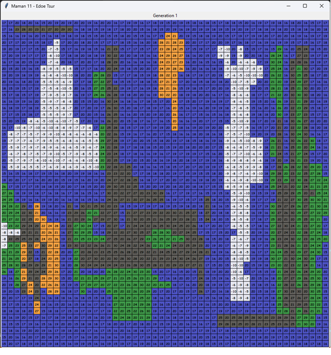

# Cellular Automata
This project is a climeate model of the world with the purpose of seeing the effect of pollution on world population and forests.

## How to Run

Make sure you have the file *cell_data.dat* as it contains the initial configuration for the grid.

`` python cellular_automata.py ``

## Example Grid Initial Configuration

Each square represents a cell and the numbers inside them represent the temprature in the cell.

The model is a 50x50 grid model when every cell in the grid has a state that consists of:
## 1. State Type
    
- ***Forest:*** Every generation subtracts 0.1 pollution from cell atmosphere.
- ***City:*** Every generation adds 0.2 pollution to cell atmosphere.
- ***Sea:*** No change to cell atmosphere.
- ***Land:*** No change to cell atmosphere.
- ***Iceberg:*** No change to cell atmosphere.

The state type can persorm the following transitions:
- Sea transforms into Land when cell temprature is 100 degrees or higher
- Sea transforms into Iceberg when cell temprature is 0 degrees or lower
- Iceberg transforms into Sea when cell temprature is 0 degrees or higher
- Forest & City transforms into Land when cell temprature is 60 degrees or higher
- Forest & City transforms into Land when cell pollution is more than 1

## 2. Temprature

This value affects the cell transitions between generations (water freezes, ice melts, cities and forests dry up, etc). The temperature is initially determined as a random value from a range of values that exists for each type of cell and later is affected by a number of different factors such as: air pollution, rains and winds.

## 3. Wind

### Wind Direction

Determined randomly each generation for each cell:
1. North (UP)
2. East (RIGHT)
3. South (DOWN)
4. West (Left)

### Wind Speed

One of three values (1,2,3) and changes as a funtion of neighboring cells' winds:
If the wind of cell Y can reach cell X, then cell Y is in the neighborhood of X. In order for the wind of one cell to reach another cell, the wind has to be stronger than the distance between them and the direction of the wind has to match. For example, if cell Y is two cells above cell X and the wind direction of cell Y is south and the wind strength is 2, it is said that cell Y is a neighbor of cell X. If, for example, the wind strength is 1 or the wind direction is not south, Y will not be considered a neighbor of X.

The wind (Direction & Speed) generates each cell's neighborhood.

## 4. Chance of Rain

Rains affect the temperature and air pollution in the cabin. The chance of rain is determined at the creation of the cell and is updated randomly throughout the generations: with a 50% chance, the chance of rain in the next generation will increase by 10%.
If the chance of rain is high enough, it will rain in the next generation and the chance of rain will return to zero.
If it rains, the temperature and air pollution drop.

## 5. Pollution

Set to zero at the creation of the cell and updated each generation based on the following parameters:
1. State Type - can increase or decrease the air pollution in the cell in the next generation
2. Rain - rain in current generation, can decrease pollution in
3. Pollution in neighbors - each cell absorbs the average air pollution of all its neighbors (average of the air pollution of the neighbors divided by the intensity of the winds in them)
4. Wind in the cell - if there is a strong wind (more than 1) in the cell, the wind clears the pollution so it resets.

# Metrics

The code generates the following metrics:
1. pollution.dat - average pollution of all cells for each day
2. temrature.dat - average temrature of all cells for each day
