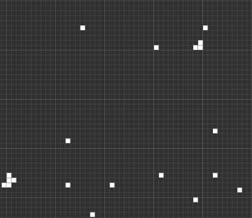

# Evolutionary Algorithms
This project is an implementation of an evolutionary algorithm that finds <a href="https://conwaylife.com/wiki/Methuselah">Methuselahs</a> in <a href="https://en.wikipedia.org/wiki/Conway%27s_Game_of_Life">Conways' Game Of Life</a>

## How to Run

Make sure you have the file to install the following libraries (using pip or other python package managers):
- random
- tkinter
- bitarray 
- numpy
- uuid
- re

`` python metushlah_finder.py ``

## Best Example Found
This initial configuration lasted a total of 1343 generations before going to stale mode

## Classes and Algoritms
The algorithm now explained is a generic algorithm for finding Methuselahs in Conway's Game of Life.
The code is divided into three classes:
1. ChromosomeVisualiser - its purpose is to visually present a certain solution. The class knows how to convert the binary representation of the chromosome into a tkinter visual display. This way you can see the progress of the generations and the best solutions.
2. GameOfLifeSimulator - its purpose is to simulate a run of the game of life on a certain chromosome. In this class, the Grecian algorithm is used to calculate as a service. As the chromosome (as an initial configuration of the game of life) reaches more generations until it stops or enters a loop, the fitness is higher.
3. MetushelahFinder - performs the generic algorithm that I will now describe.

## Generic Algorithm
The algorithm uses the following evolutionary elements:
1. **Chromosome Representation:** I chose to represent the configuration of the game of life as a bit sequence of GRID_SIZE x GRID_SIZE (where GRID_SIZE is the size of the matrix of the game of life - currently set to 50). Each living cell is represented by 1 and a dead cell by 0. For example, if a cell at position (10,20) is alive, then in the binary sequence the bit at position (10*50+20=520) will be 1.

2. **Chromosome Validity:** at each stage of a chromosome's life (its creation, addition of mutations and replacement with another chromosome) we would like to make sure that the number of living cells at the beginning of the game of life symbol does not exceed a certain amount (currently set at 30 cells but can be changed by MAX_INITIAL_CONFIGURATION_SIZE), that is In order not to reach a situation where, with the help of many mutations and substitutions, we will get a methushlah where the amount of initial cells in it is the entire network and, in general, in order to meet the condition that the methushlah is a small initial configuration, this correctness is enforced in different ways at each stage of the algorithm.

3. **Mutation:** Appropriate to the representation of a binary sequence, a mutation is defined as a change of zero to one or one to zero. For each cell, the chance of mutation is determined and in addition the amount of cells currently alive in the chromosome is checked and if we have reached the defined maximum, we will not turn on another cell. The order of the bits that will be mutated will be filtered so that there is no situation where all the mutations happen only at the beginning.

4. **Transition:** Again, as is appropriate for the representation of a binary sequence, we define transition as a combination of two parents by drawing the intersection point and combining part A of parent A with part B of parent B and part B of parent A with Part A of parent B, thereby creating two new offspring in the population. The parents were chosen using the roulette method and with a certain probability (currently set at 90 percent but can be changed by CROSSOVER_CHANCE) the parents alternate. Otherwise, they continue as they are to the next generation of the algorithm. Testing the normality of the new chromosomes is counting the lit cells and doing more and more that pass until 2 new normal chromosomes are obtained.

5. **Population:** I chose to work with a population of 100 chromosomes, so that in each generation there is a transition of the elite from the previous generation to the next generation (10 percent pass - elitism) and the remaining ninety percent are filled by replacements or transitions from the current generation to the next generation.

6. **Fitness Function:** The fitness function for this algorithm is a calculation of the game of life using the GameOfLifeSimulator class. The stopping condition I chose is the repetition of a configuration on itself during the generations of the dawn of life simulation. According to the definition, the strength of the sent is determined by the number of generations which takes him to stabilize. In my opinion, the meaning of this stabilization is that each group of cells is in a loop that repeats itself or in a lack of change between generations. Therefore, it is possible to check if a configuration repeats itself and as soon as it does, decide that the chromosome has finished and return the number of generations as the chromosome capacity.
The way I chose to represent the repeatability of a configuration in the game of life is by a hash list that holds all the previous generations of the current chromosome and as soon as a new configuration is found whose hash already exists in the list, the calculation stops.

7. **Stopping Conditions:** Since there is no knowledge of the ultimate solution that can continue forever, I determined that if the algorithm is constant (does not find a better service) for 500 generations, it will realize that it will get stuck and stop its run.