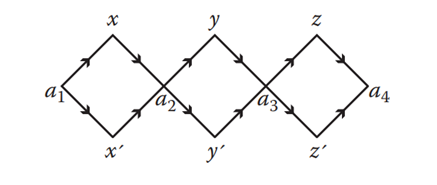

# Molecular Computation - 3SAT Solver

3SAT is an NP-hard problem which can be solved in linear time using molecular computation as will be showed in the following algoritm:

## How to Run

`` python 3sat_molecular_solver.py ``

## The Problem
A Boolean equation in 3-cnf configuration is given and we must return 

## Solution Represintation

We will present the solution of the 3-SAT problem with the help of molecular calculation:
We will use the principles of Alderman's algorithm to design a molecular calculation algorithm and create a helper graph:

A solution to the pronlem is an assignment to the given formuala and is represented as a path in the helper graph, where every untagged node represents a True assigment to the appropriate variable and the tagged node represents a False assigment. 

After we have built the graph, we will move on to find all the possible routes in it so that each route is a potential solution to the problem.
We will continue to filter all the tracks that came out that are not the right size so that we will run the DNA sequences through a gel and remove only the appropriate tracks.

## The Algorithm 

1. For each clause in the equation:
    1. Create a temporary test tube.
    2. For each variable in the current clause:
        1. Transfer to the temporary test tube all tracks that contain the current variable.
    3. Pour out all other lanes and return the contents of the temporary tube to the main tube.
2. Check if there are any solutions left. If they remain the equation is sufficient otherwise it is not.

## Runtime Complexity
### Helper Graph Construction
In a wet lab it is a fixed time which is the creation of enough genetic material before running the lab, but in a dry lab like ours we use a loop that runs on all the variables so it can be said that the complexity is linear to the size of the input.

### Finding Paths (Solutions)
In a wet lab all the pathways are built at the same time, but in a wet lab we have to iteratively go over all the genetic material and assemble all the different pathways in the graph. In order to produce enough genetic material, I made copies of each molecule as the number of different possible routes, which is $2^{|variables|}$. Therefore finding the routes is exponential to the size of the input.

### Sufficiency Test
In the wet lab, as in the dry lab, we must go over each clause in the formula and within each clause on each variable. Therefore in both cases the running time is linear to the size of the input.

It should be noted that in a wet lab trivial actions of arranging tracks by length (passing through the gel), filtering tracks according to appropriate size, selecting all the coils that contain a certain sequence (attachment of a magnet with the reverse sequence) are actions that in a wet lab happen in fixed time but in a dry lab happen in linear time to input as the capability of a standard processor.

In order to make sure that the code I wrote is indeed correct, I added two equations whose results are shown (in addition to the random equation that is created): one is sufficient and the other is not sufficient.