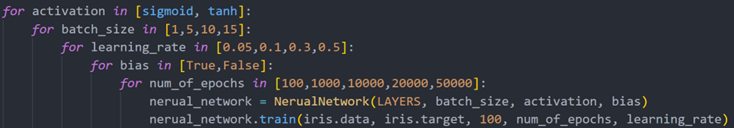
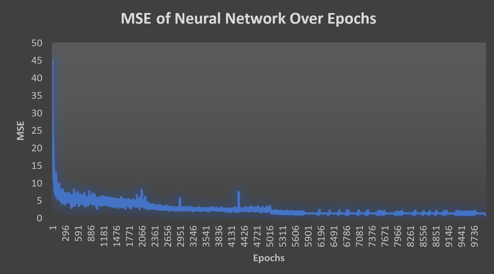

# Nerual Network
This project is an implementation of a classifier nerual network that classifies the known <a href="https://en.wikipedia.org/wiki/Iris_flower_data_set">Iris Dataset</a>.

The code uses numpy for easy vector multipication and implements back propagation and gradient decsent for the learning process.

There are 3 availabe activation functions for different results:
1. TanH
2. Sigmoid
3. Binary

## Network Structure
I chose to implement a multi-layer percpetron with 4 inputs, 2 hidden layes with 7 neurons each and 3 output neurons.

## Network Configuration
In order to test what configuration will be best for the chosen architecture, I used the following code:

The code resulted in the following conclusions:
1. The sigmoid function results in smaller errors in testing and training than the tanh function
2. In the area of 10,000 epochs (mainly) we will reach a minimal error and then it may increase slightly (overfitting)
3. The higher the learning rate, the better the network will learn (in the series of epochs I defined) the classification function.
4. The smaller the batches, the better the network learns and the smaller the error.

Therfore, the chosen configuration is: 
- The activation function is sigmoid
- The network performs 10,000 epochs on the training information
- The learning rate is 0.5
- The batch size is 1 (Online)

